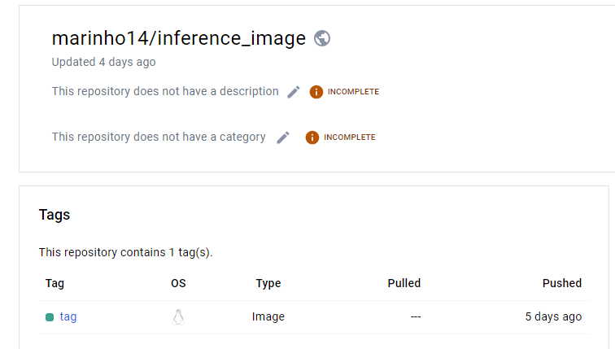
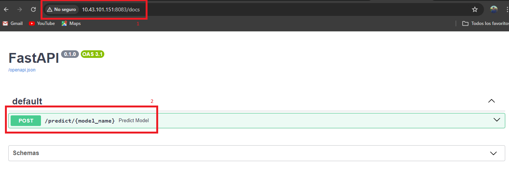
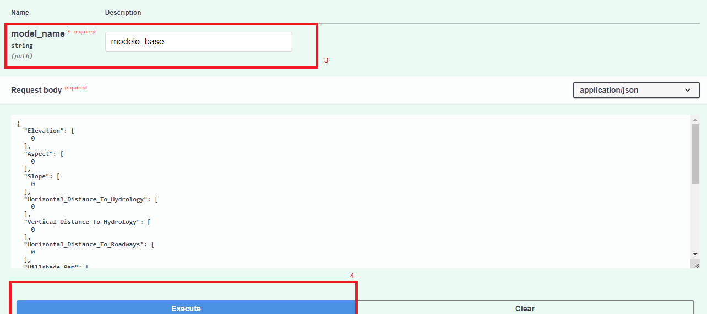
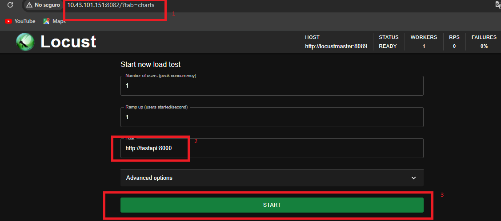
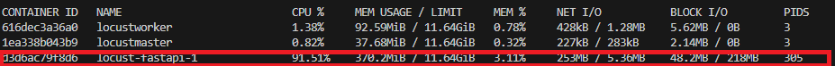
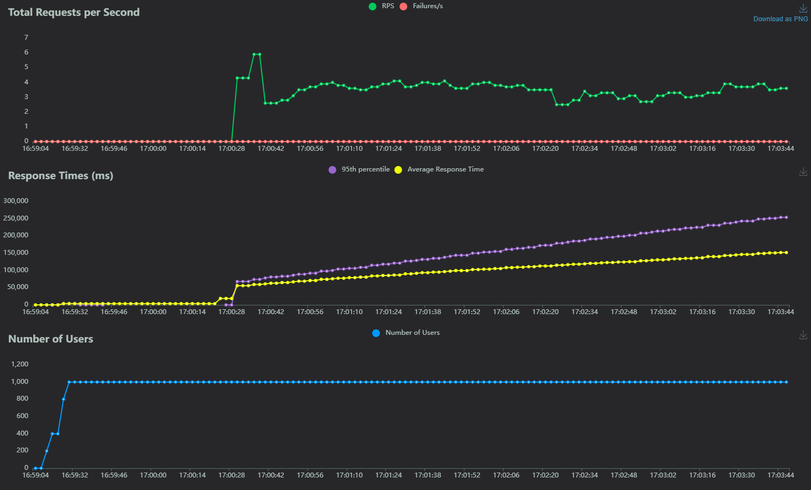
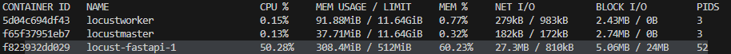

# Taller de Inferencia con Docker, FastAPI y MLflow

Este taller cubre la creación de una API de inferencia usando FastAPI y MLflow, y cómo desplegarla en Docker.

## Contenido

1. [Crear una imagen de Docker](#1-crear-una-imagen-de-docker)
2. [Publicar la imagen en DockerHub](#2-publicar-la-imagen-en-dockerhub)
3. [Usar la imagen con docker-compose](#3-usar-la-imagen-con-docker-compose)
4. [Pruebas de carga con Locust](#4-pruebas-de-carga-con-locust)
5. [Limitar recursos del contenedor](#5-limitar-recursos-del-contenedor)

Primero conectese a la Maquina Virtual del grupo 2 y dirijase a la ubicación: 

```bash
cd /home/estudiante/MLOps/Taller_4
```

## 1. Crear una imagen de Docker

Se crea una imagen que contiene una API Usando FastAPI, esta hacer inferencia mediante el modelo implementado en el pryecto, tal como se explicara mas adelante. La imagen creada se encuentra en la siguiente ubicación.

[Imagen](docker_hub/Dockerfile)


## 2. Publicar la imagen en DockerHub

Posteriormente se usaron las credenciales de una cuenta de Dockerhub, y se subio la imagen constuida en el anterior punto, esta se encuentra en el siguiente link: https://hub.docker.com/repository/docker/marinho14/inference_image/general



## 3. Usar la imagen con docker-compose

Primero dirijase a la siguiente ruta: 

```bash
cd /home/estudiante/MLOps/Taller_4/call_docker_hub
```

Para poder utilizar la API es importante levantar los contenedores del Proyecto 2, en donde se encuentra el modelo a usar, hagalo mediante el siguiente comando:

```bash
docker compose -f /home/estudiante/MLops_P2/docker-compose.yml up -d
```

Posteriormente levante el docker compose el cual llama la imagen publicada en dockerhub.

```bash
docker compose up
```

Cuando el contenedor este levantado dirijase a la [Url de la API](http://10.43.101.151:8083/docs "API"), en donde se encontrar con una interfaz como la siguiente:



Luego de verificar que se encuentre en la IP correcta, se encontrara con el metodo POST, el cual debe ejecutar con las siguientes configuraciones:



Termine la ejecución de ese contenedor en la terminal usando "CTRL+C" y espere a que se detenga.

## 4. Pruebas de carga con Locust

Primero dirijase a la siguiente ruta:

```bash
cd /home/estudiante/MLOps/Taller_4/locust
```

De nuevo es importante verificar que se tengan levantados los contenedores del proyecto 2:

```bash
docker compose -f /home/estudiante/MLops_P2/docker-compose.yml up -d
```

Ahora levante el docker compose que levanta la API junto con locust lo que nos permitira hacer pruebas de carga a nuestra imagen de inferencia:

```bash
docker compose up
```

Posteriormente dirijase a la [Url de locust](http://10.43.101.151:8082/ "Locust"), alli debe configurar el host al cual haremos la prueba de carga, **ASEGUESE** de tener este como se muestra en imagen:



Siguiente presione "START", de este modo empezará la prueba de carga a nuestra API, se deberian ver las estadisticas como se muestra a continuación:


## 5. Limitar recursos del contenedor

Al intentar hacer 10 mil peticiones por segundo el contenedot caia, para efectos practicos de este punto, se opto por usar 1000 peticiones con un Ramp Up de 100.

Se obtuvieron las stats de los contenedores con estas caracteristicas:



Obteniendo la siguiente grafica:



Se pusieron las siguientes caracteristicas y funciono correctamente.

```yml
limits:
    cpus: '0.9'  # Limitar el contenedor a utilizar el 50% de una CPU
    memory: 512M  # Limitar el contenedor a utilizar 512 MB de memoria
reservations:
    memory: 256M  # Reservar 256 MB de memoria para el contenedor
```

Posteriormente se redujeron las caracteriticas para probar si se podia limitar y que siguiera funcionando:


```yml
limits:
    cpus: '0.5'  # Limitar el contenedor a utilizar el 50% de una CPU
    memory: 512M  # Limitar el contenedor a utilizar 512 MB de memoria
reservations:
    memory: 256M  # Reservar 256 MB de memoria para el contenedor
```

Dando como resultado:




Con el fin de lograr los  10mil usuarios se duplico le memoria reservada de 256 a 512MB y se dejo el limite de memoria del contenedor en 512 MB
limitando el uso de CPU al 75%  con la sigiente configuracion:

```yml
limits:
    cpus: '0.75'  # Limitar el contenedor a utilizar el 75% de una CPU
    memory: 512M  # Limitar el contenedor a utilizar 512 MB de memoria
reservations:
    memory: 512M  # Reservar 512 MB de memoria para el contenedor
```
Al ejecutar nuevamente el locust con una configuracion de 10mil usuarios llegando de a 1000 usuarios por segundo observamos que la mayor parte del uso de CPU se va en simular los usuarios por parte del Locust mientras que el Fastapi su porcentaje de CPU no supera el 1% como se puede ver en las imagenes siguientes:


